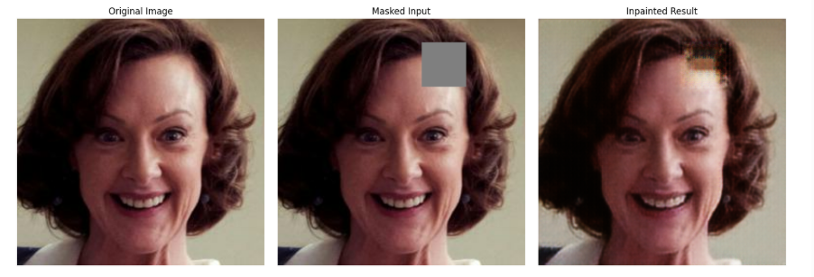

<h1>🎨 Image Inpainting using CNN</h1>
<div align="center">
  
</div>
<div align="center">
  <b>** Images used are from celeba_hq dataset</b>
</div><br>

A deep learning project applying convolutional neural networks (CNNs) to perform image inpainting — restoring missing or corrupted regions in images. This project demonstrates skills in computer vision, neural network design, and image processing pipeline development.

 <b>🔍 Project Overview</b>

Image inpainting is the task of reconstructing missing or damaged parts of an image in a visually plausible way. This repository implements a CNN-based model that learns to fill missing patches by understanding the context of surrounding pixels.

The goal is to restore images with masked regions, whether randomly masked blocks or real-world corruptions, and produce seamless, realistic inpainted output.

<b>🛠️ Features & Components</b>

- Data Preparation & Masking
  Generation of input images with masked regions (e.g. square patches, random missing pixels).

- CNN Architecture
  Build encoder-decoder or U-Net style convolutional network for inpainting.

- Training & Optimization  
  Loss functions (e.g. MSE, perceptual loss), regularization, epochs, checkpoints.

- Evaluation & Visualization  
  Side-by-side comparisons: original, masked, and inpainted images.

- Prediction / Inference Pipeline  
  A script or notebook to apply the trained model to new images for inpainting.

 <b>📂 Repository Structure</b>

Image-Inpainting-using-CNN/

├── data/ # (optional) training / testing image datasets

├── models/ # saved model weights / checkpoints

├── notebooks/ # Jupyter notebooks for experiments & visualization

├── scripts/ # scripts for training, testing, inference

├── requirements.txt # project dependencies

└── README.md # this file


<b> 🧰 Technologies & Skills Demonstrated</b>

| Area | Tools / Libraries |
|------|--------------------|
| Deep Learning | TensorFlow / Keras or PyTorch |
| Computer Vision | image processing, masks, data augmentation |
| Model Architecture | CNNs, encoder-decoder, skip connections |
| Training & Evaluation | loss functions, metrics, tuning |
| Data Visualization | matplotlib, PIL / OpenCV |
| Project Engineering | modular code, checkpointing, reproducibility |


 <b>📋 Installation & Usage</b>

Prerequisites
- Python 3.7+  
- GPU (optional but recommended)  
- pip or conda environment

Steps

1. Clone the repo:  
   ```bash
   git clone https://github.com/UK183/Image-Inpainting-using-CNN.git
   cd Image-Inpainting-using-CNN
2. Install dependencies:

    ```bash
    pip install -r requirements.txt
    
3. Prepare dataset or provide image folder (with masks).
   Train the model:
    ```bash
    python scripts/train.py
4. Perform inference / inpainting on new images:
    ```bash
    python scripts/inference.py --input path/to/image.jpg
    
Visualize results (in notebooks or output folder) — compare original vs masked vs inpainted.

<b>📊 Results & Examples:</b>

Demonstrative examples showing original, masked, and inpainted images side by side.

Quantitative metrics (PSNR, SSIM, MSE) comparing performance across epochs or architectures.

Visual comparisons and qualitative evaluation of inpainted outputs.

<b>🧠 Key Learnings:</b>

Gained hands-on experience designing CNN architectures for contextual image reconstruction.

Understood loss design (e.g. pixel-wise loss vs perceptual loss) and trade-offs in image generation tasks.

Learned scalable training, checkpointing, and inference workflows for CV tasks.

Improved ability to process and augment image data for neural network input.

<b>⚠️ Note:</b> This is a research/portfolio project. For production use, you may want to include more advanced architectures, handle edge cases, and ensure robustness.

---
### 👤 Author
[**Kazi Umar**](https://github.com/UK183)<br>
Linkedin profile: https://www.linkedin.com/in/umar-kazi18  
💼 Data Analyst | ML Engineer | Data Science & AI Enthusiast | Power BI | Python | SQL
